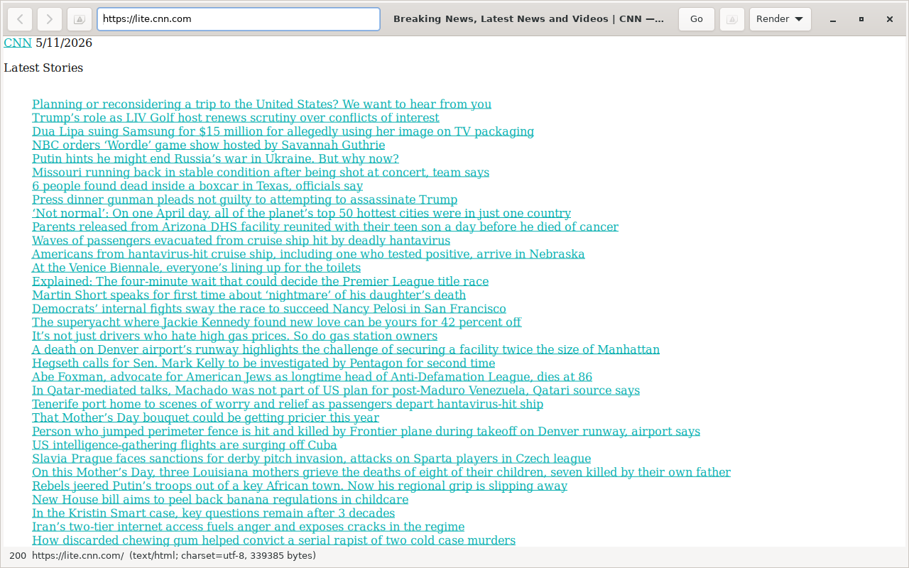
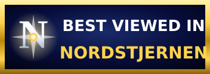

Nordstjernen web browser
=======================

Nordstjernen is a web browser written in C, created in 2026, with focus on HTML 5, modern JavaScript, minimalism and security. Nordstjernen is a hardened, zero-JIT HTML/CSS rendering engine for secure general web browsing, office document reading, students and universities, government, embedded systems and industrial automation, and embedding the browser in other systems.







[](https://github.com/nordstjernen-web/nordstjernen/actions/workflows/linux.yml)
[](https://github.com/nordstjernen-web/nordstjernen/actions/workflows/macos.yml)
[](https://github.com/nordstjernen-web/nordstjernen/actions/workflows/windows.yml)


## Why

- **Auditable.** Engine, JS bindings, chrome, and sandbox in ~40 kLOC of C.
- **Light.** Cold-starts in milliseconds, idles at a few tens of MB.
- **No telemetry, ever.** No phone-home, no update pinger, no Safe
  Browsing, no crash reports, no "studies".
- **Independent.** Not Blink, not WebKit, not Gecko. Clean-room, in C.
- **Privacy by default.** Partitioned cookies, third-party cookies off,
  DNT, HSTS, CSP, mixed-content blocking.
- **Hardened.** Landlock + seccomp sandbox, no-root, PIE, full RELRO,
  stack protector, Intel CET, `_FORTIFY_SOURCE=2`. No JIT (W^X holds
  process-wide).
- **Built in Norway**, source-available under the Nordstjernen Source
  License v1.0 (converts to MIT ten years after each release).


## What works

### Rendering
- HTML5 (lexbor parser).
- Modern CSS cascade: custom properties (`var()`), `:is`/`:where`/`:has`
  (bounded), flex, grid (`minmax()`, `auto-fit`/`auto-fill`,
  `grid-template-areas`), `position: sticky`, `overflow` clipping,
  `display: table` fallback, justify text.
- CSS transitions and `@keyframes` animations on `opacity` and
  `transform` (honours `prefers-reduced-motion`).
- Per-site compatibility CSS + DOM rewriters
  (`data/compatibility-css/`); users can override under
  `$XDG_DATA_HOME/nordstjernen/compatibility-css/`.

### JavaScript (QuickJS, no JIT)
- Broad DOM, `fetch`/XHR, `Range`/`Selection` bound to live selection,
  geometry-aware `IntersectionObserver`, Subresource Integrity on
  `<script>` and `<link>`.

### Networking
- HTTPS via libcurl, gzip + brotli + zstd response decoding.
- WHATWG URL via lexbor URL module, IDN (Unicode) hostnames end-to-end.
- Charset detection via uchardet.
- HSTS, CSP, mixed-content blocking, partitioned cookies.
- HTTP / HTTPS / SOCKS proxies (`--proxy=`, `ND_HTTP_PROXY`, etc.;
  `socks5h://` for Tor). See [docs/Proxy.md](docs/Proxy.md).
- Plain-file HTTP cache honouring `Cache-Control` / `ETag` /
  `Last-Modified`.

### Media
- Images: PNG, GIF (animated), BMP, JPEG via Wuffs; TIFF / ICO / WebP
  via GDK-Pixbuf; SVG via librsvg; AVIF optional.
- Video: WebM/VP9 via libvpx (in-page `<video>`).
- Audio: PulseAudio (Linux), WinMM (Windows).

### Internationalisation
- Renders any script the host has fonts for (Latin, Cyrillic, Greek,
  Arabic, Hebrew, Devanagari, Thai, CJK, …) via HarfBuzz / FriBidi /
  Pango.
- HTML `lang` picks CJK regional glyphs; `dir="rtl"` flips paragraph
  base direction. UI itself is English-only. See
  [docs/i18n.md](docs/i18n.md).

### Browser chrome
- One window per page (no tab strip — the OS window manager *is* the
  affordance).
- Bookmarks popover with open-in-new-window and delete.
- Find-in-page with N-of-M, Shift-Enter for previous, case-sensitive
  toggle, Esc to dismiss.
- Save Page As HTML.
- Print with block-aware pagination (page breaks snap to block
  boundaries instead of slicing paragraphs in half).
- JS console with environment banner (engine versions, layout time).
- Headless mode:
  `nordstjernen --headless --dump=<text|dom|layout|png:PATH|pdf:PATH> URL`.

### Platforms
- Linux (GTK 4 native, meson + ninja, RPM via `scripts/pack-rpm.sh`).
- Windows (MSYS2 / MINGW64, NSIS installer via
  `scripts/pack-windows-installer.sh`).
- macOS (Homebrew, Apple Silicon + Intel).


## What we deliberately don't do

The exploit- and bloat-prolific surface area of modern browsers is
foreclosed by design — these are non-goals, not gaps:

- No WebGL, WebGPU, WebRTC, WebUSB, WebBluetooth, WebHID, WebMIDI.
- No service workers, push notifications, background sync.
- No MSE / EME / Widevine / DRM. (YouTube's player needs MSE and so
  isn't supported; direct WebM URLs play.)
- No JIT. (QuickJS is a bytecode interpreter.)
- No extensions, no plugins, no NPAPI/PPAPI shims.
- No persistent browsing history — the back/forward stack lives only
  in memory.
- No sync, no accounts, no "studies", no telemetry of any kind.
- No localisation beyond English (for now).
- No tab strip.


## Status (v0.6.0)

Engine work for 0.6 is largely landed: animated GIF, Range/Selection,
grid areas + `minmax`, overflow clipping, sticky positioning,
`:is`/`:where`/`:has`, SRI, brotli + zstd, IDN URLs, `lang`/`dir`,
Windows audio, proxy support, CSS transitions + `@keyframes`,
block-aware print pagination. Still open before tagging 0.6.0:
Windows code-signing, macOS notarized DMG, Flathub manifest. See
[NORDSTJERNEN.md](NORDSTJERNEN.md) for the live punch list.


## Build

```sh
# Debian / Ubuntu
sudo apt install build-essential pkg-config meson ninja-build cmake \
    libgtk-4-dev libcurl4-openssl-dev libuchardet-dev librsvg2-dev \
    libpsl-dev libseccomp-dev

meson setup builddir
meson compile -C builddir
./builddir/src/nordstjernen
```

Fedora / RHEL / openSUSE one-liners and the MSYS2 / Homebrew recipes
are in [CLAUDE.md](CLAUDE.md), [docs/Windows.md](docs/Windows.md),
and [docs/macOS.md](docs/macOS.md).

Lexbor, QuickJS (v0.14.0), and Wuffs are pulled in as meson
subprojects — no git submodules, no runtime downloads.

Configurable via `~/.config/nordstjernen/nordstjernen.conf`. Run
`nordstjernen --print-config` to see the effective config. Defaults:
home `https://duckduckgo.com/lite/`, search
`https://lite.duckduckgo.com/lite/?q=%s`, `Accept-Language`
auto-detected from the OS locale.


## Dependencies

### Vendored (built into the binary)

| Library | Version | Role |
| --- | --- | --- |
| [lexbor](https://github.com/lexbor/lexbor) | 3.0.0 | HTML5 + WHATWG URL + CSS selector matcher |
| [quickjs-ng](https://github.com/quickjs-ng/quickjs) | v0.14.0 | JavaScript (no JIT) |
| [Wuffs](https://github.com/google/wuffs) | v0.4 | Memory-safe PNG / GIF / BMP / JPEG decoder |

### Required system packages (Linux)

`libgtk-4-dev`, `libcurl4-openssl-dev`, `libuchardet-dev`,
`librsvg2-dev`, `libpsl-dev`, `libseccomp-dev`, plus the toolchain
(`build-essential`, `meson`, `ninja-build`, `cmake`, `pkg-config`).

### Optional

`libvpx-dev` (WebM `<video>`), `libpoppler-glib-dev` (inline PDF),
`libavif-dev` (AVIF), `ccache`, `lld`.


## Why another browser?

Almost every browser today renders pages with one of three engines —
Blink (Chrome, Edge, Opera, Brave, Vivaldi, every Electron app),
WebKit (Safari, and on iOS *everything*), or Gecko (Firefox). Blink
and WebKit share a common ancestor; Gecko is the last fully
independent engine in serious production. A monoculture this complete
is bad for the web in the same way a monoculture is bad for a forest:
a single business decision propagates to every user at once. The
web's resilience depends on independent implementations actually
existing — implementations that can disagree, say no, and refuse to
render the bloat. That is what Nordstjernen is.

Nordstjernen is built **in Norway**, by a Norwegian developer. We
think a free internet needs browsers that aren't all designed inside
the same square mile of California. Privacy on, telemetry off,
advertising-free, the user's data stays on the user's machine. The
North Star is the fixed point in the Norwegian night sky; the browser
tries to be the same kind of thing on the web — small, steady, and
pointed in one direction.


## License

Nordstjernen Source License v1.0 (`NSL-1.0`). Use, copy, modify, and
redistribute for any purpose other than offering a competing browser
product or service. Each release converts to MIT ten years after
publication. See [`License.md`](License.md).

**Commercial licensing.** Separate commercial licenses are available
by written agreement — including for competing uses, embedding in a
proprietary product, or redistribution under different terms. Contact
the project at <https://nordstjernen.org>.

Copyright 2026 Andreas Røsdal. Developed with extensive use of AI
tooling.

---

Project home: https://nordstjernen.org

Source: https://github.com/nordstjernen-web/nordstjernen
